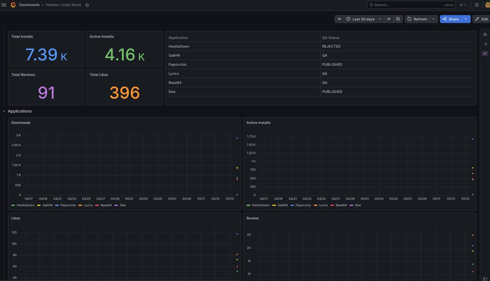

# Harbour stats

Docker Compose setup to monitor [Harbour (Jolla Store)](https://harbour.jolla.com) stats with Harbour Exporter, Prometheus, Grafana, and Alertmanager.



## Services

| Service | Port | Purpose |
|---|---|---|
| **harbour-exporter** | 9101 | Scrapes Harbour API, exposes Prometheus metrics |
| **Prometheus** | 9090 | Scrapes the exporter every 3 hours, evaluates alert rules |
| **Grafana** | 3000 | Dashboard with stats |
| **Alertmanager** | 9093 | Sends email when an app gets a new review |

## Quick start

1. `cp .env.example .env` and set Harbour credentials there
1. To receive emails, edit `alertmanager/config.yml` with your SMTP details

```bash
docker compose up -d
```

The example Prometheus configuration is set to scrape the Harbour exporter
every hour, as there is no need to overload the Jolla servers. Due to the way
Prometheus works, this means that upon first launch, data will not be available
on the dashboard for at least an hour.

Grafana is available at http://localhost:3000 (admin / `$GRAFANA_ADMIN_PASSWORD`)
